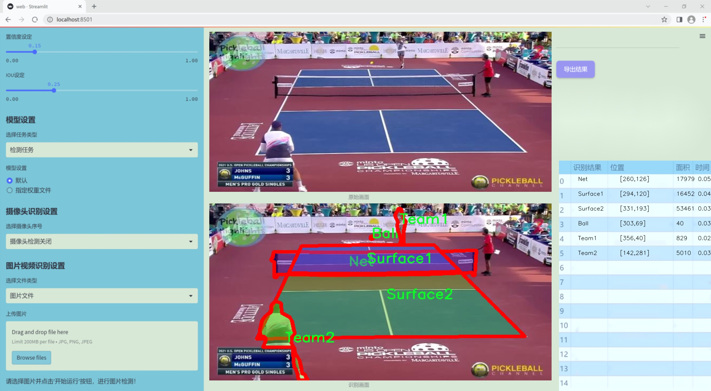
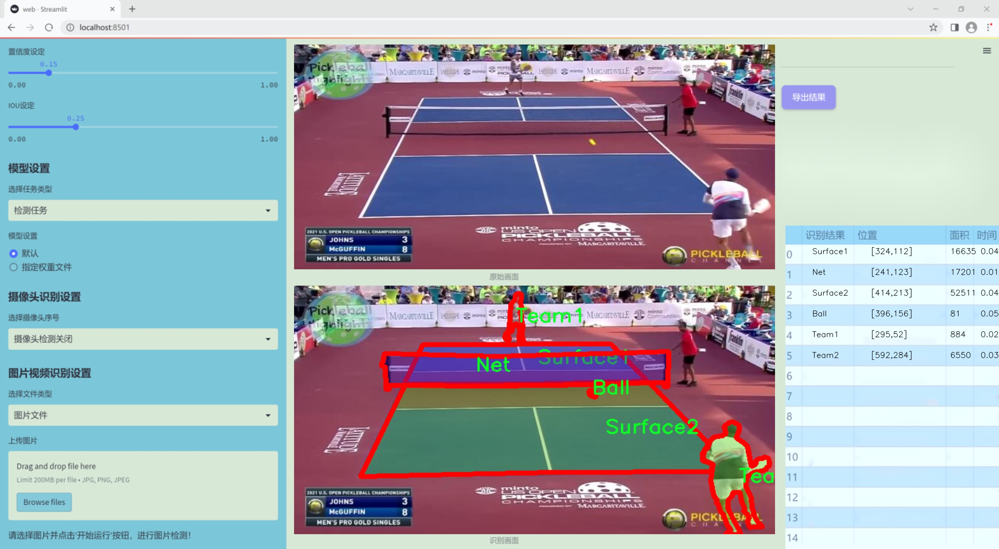
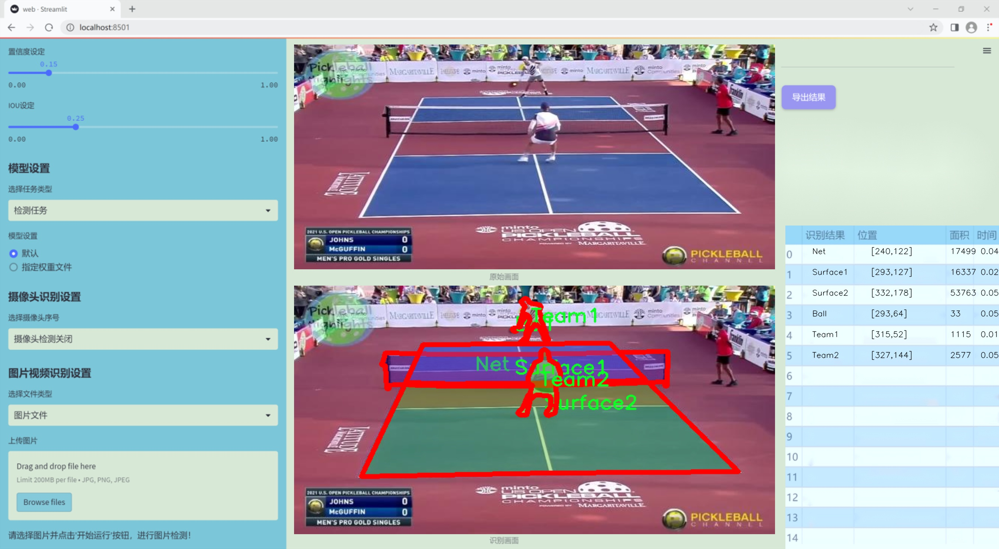
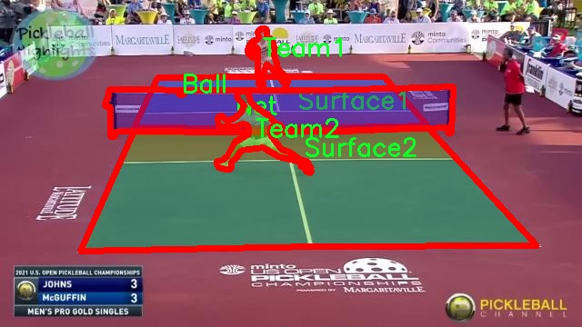
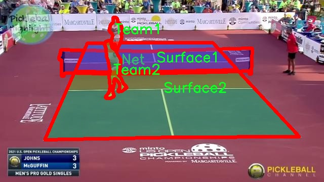
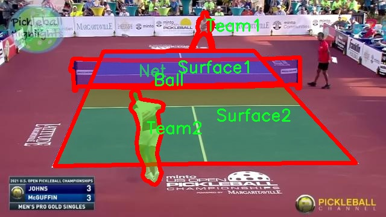
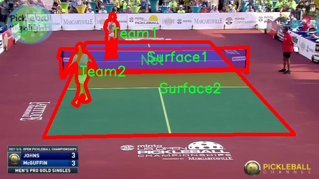
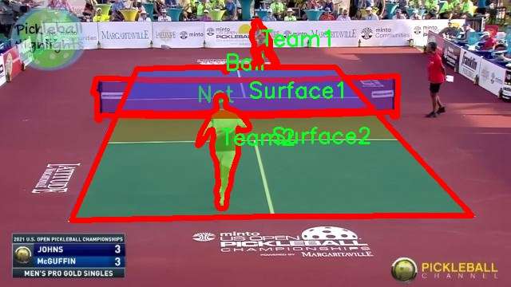

### 1.背景意义

研究背景与意义

随着计算机视觉技术的快速发展，图像分割和物体检测在多个领域中得到了广泛应用，尤其是在体育赛事分析中。网球作为一项全球广受欢迎的运动，其比赛场景的自动分析不仅能够提升观众的观看体验，还能为教练和运动员提供有价值的数据支持。基于此，开发一个高效的网球场景检测图像分割系统显得尤为重要。本研究旨在基于改进的YOLOv11模型，构建一个能够准确识别和分割网球场景中关键元素的系统。

本项目所使用的数据集包含六个类别，包括“Ball”（球）、“Net”（网）、“Surface1”（场地表面1）、“Surface2”（场地表面2）、“Team1”（队伍1）和“Team2”（队伍2）。这些类别的选择不仅涵盖了网球比赛的基本要素，还为后续的分析提供了丰富的信息。通过对200幅图像的标注与处理，数据集为模型的训练提供了坚实的基础。

在实际应用中，准确的图像分割可以帮助教练分析比赛策略，评估运动员表现，并为观众提供实时的比赛数据。改进的YOLOv11模型通过优化检测精度和速度，能够在复杂的网球场景中快速而准确地识别出各个关键元素。这一系统的实现将为网球赛事的智能分析提供新的思路和方法，推动体育数据分析的进步。

综上所述，本研究不仅具有重要的学术价值，还具备广泛的应用前景。通过提升网球场景的自动检测与分割能力，能够为体育领域的智能化发展贡献力量，同时也为其他运动项目的图像分析提供借鉴和参考。

### 2.视频效果

[2.1 视频效果](https://www.bilibili.com/video/BV1EVBYYZE5m/)

### 3.图片效果







##### [项目涉及的源码数据来源链接](https://kdocs.cn/l/cszuIiCKVNis)**

注意：本项目提供训练的数据集和训练教程,由于版本持续更新,暂不提供权重文件（best.pt）,请按照6.训练教程进行训练后实现上图演示的效果。

### 4.数据集信息

##### 4.1 本项目数据集类别数＆类别名

nc: 6
names: ['Ball', 'Net', 'Surface1', 'Surface2', 'Team1', 'Team2']


该项目为【图像分割】数据集，请在【训练教程和Web端加载模型教程（第三步）】这一步的时候按照【图像分割】部分的教程来训练

##### 4.2 本项目数据集信息介绍

本项目数据集信息介绍

本项目所使用的数据集名为“Pickleball Seg”，旨在为改进YOLOv11的网球场景检测图像分割系统提供支持。该数据集专注于捕捉和标注与Pickleball运动相关的图像信息，涵盖了六个主要类别，分别为“Ball”（球）、“Net”（网）、“Surface1”（表面1）、“Surface2”（表面2）、“Team1”（队伍1）和“Team2”（队伍2）。这些类别的设计旨在全面反映Pickleball比赛中的关键元素，以便于系统在实际应用中能够准确识别和分割不同的对象。

数据集中的图像经过精心挑选，涵盖了多种场景和环境条件，确保了模型在不同光照、角度和背景下的鲁棒性。每个类别的样本数量经过合理分配，以保证模型在训练过程中能够获得均衡的学习机会，从而提升其在实际应用中的性能。例如，球的样本数量相对较多，以反映其在比赛中的重要性，而网和表面类别则通过多样化的场景设置来增强模型对环境变化的适应能力。

此外，数据集的标注工作采用了高标准的质量控制流程，确保每个图像中的对象都得到了准确的标注。这一过程不仅提高了数据集的可靠性，也为后续的模型训练提供了坚实的基础。通过使用“Pickleball Seg”数据集，研究团队希望能够显著提升YOLOv11在Pickleball场景中的检测和分割能力，从而推动相关领域的研究和应用发展。整体而言，该数据集的构建和应用将为实现高效、准确的图像分割系统奠定重要基础。











### 5.全套项目环境部署视频教程（零基础手把手教学）

[5.1 所需软件PyCharm和Anaconda安装教程（第一步）](https://www.bilibili.com/video/BV1BoC1YCEKi/?spm_id_from=333.999.0.0&vd_source=bc9aec86d164b67a7004b996143742dc)


[5.2 安装Python虚拟环境创建和依赖库安装视频教程（第二步）](https://www.bilibili.com/video/BV1ZoC1YCEBw?spm_id_from=333.788.videopod.sections&vd_source=bc9aec86d164b67a7004b996143742dc)

### 6.改进YOLOv11训练教程和Web_UI前端加载模型教程（零基础手把手教学）

[6.1 改进YOLOv11训练教程和Web_UI前端加载模型教程（第三步）](https://www.bilibili.com/video/BV1BoC1YCEhR?spm_id_from=333.788.videopod.sections&vd_source=bc9aec86d164b67a7004b996143742dc)


按照上面的训练视频教程链接加载项目提供的数据集，运行train.py即可开始训练



     Epoch   gpu_mem       box       obj       cls    labels  img_size
     1/200     20.8G   0.01576   0.01955  0.007536        22      1280: 100%|██████████| 849/849 [14:42<00:00,  1.04s/it]
               Class     Images     Labels          P          R     mAP@.5 mAP@.5:.95: 100%|██████████| 213/213 [01:14<00:00,  2.87it/s]
                 all       3395      17314      0.994      0.957      0.0957      0.0843

     Epoch   gpu_mem       box       obj       cls    labels  img_size
     2/200     20.8G   0.01578   0.01923  0.007006        22      1280: 100%|██████████| 849/849 [14:44<00:00,  1.04s/it]
               Class     Images     Labels          P          R     mAP@.5 mAP@.5:.95: 100%|██████████| 213/213 [01:12<00:00,  2.95it/s]
                 all       3395      17314      0.996      0.956      0.0957      0.0845

     Epoch   gpu_mem       box       obj       cls    labels  img_size
     3/200     20.8G   0.01561    0.0191  0.006895        27      1280: 100%|██████████| 849/849 [10:56<00:00,  1.29it/s]
               Class     Images     Labels          P          R     mAP@.5 mAP@.5:.95: 100%|███████   | 187/213 [00:52<00:00,  4.04it/s]
                 all       3395      17314      0.996      0.957      0.0957      0.0845


###### [项目数据集下载链接](https://kdocs.cn/l/cszuIiCKVNis)

### 7.原始YOLOv11算法讲解


##### YOLO11介绍

Ultralytics YOLO11是一款尖端的、最先进的模型，它在之前YOLO版本成功的基础上进行了构建，并引入了新功能和改进，以进一步提升性能和灵活性。
**YOLO11设计快速、准确且易于使用，使其成为各种物体检测和跟踪、实例分割、图像分类以及姿态估计任务的绝佳选择。**


**结构图如下：**


##### **C3k2**

**C3k2，结构图如下**


**C3k2，继承自类`C2f，其中通过c3k设置False或者Ture来决定选择使用C3k还是`**Bottleneck


**实现代码** **ultralytics/nn/modules/block.py**

##### C2PSA介绍

**借鉴V10 PSA结构，实现了C2PSA和C2fPSA，最终选择了基于C2的C2PSA（可能涨点更好？）**


**实现代码** **ultralytics/nn/modules/block.py**

##### Detect介绍

**分类检测头引入了DWConv（更加轻量级，为后续二次创新提供了改进点），结构图如下（和V8的区别）：**


### 8.200+种全套改进YOLOV11创新点原理讲解

#### 8.1 200+种全套改进YOLOV11创新点原理讲解大全

由于篇幅限制，每个创新点的具体原理讲解就不全部展开，具体见下列网址中的改进模块对应项目的技术原理博客网址【Blog】（创新点均为模块化搭建，原理适配YOLOv5~YOLOv11等各种版本）

[改进模块技术原理博客【Blog】网址链接](https://gitee.com/qunmasj/good)


#### 8.2 精选部分改进YOLOV11创新点原理讲解

###### 这里节选部分改进创新点展开原理讲解(完整的改进原理见上图和[改进模块技术原理博客链接](https://gitee.com/qunmasj/good)【如果此小节的图加载失败可以通过CSDN或者Github搜索该博客的标题访问原始博客，原始博客图片显示正常】

### 可扩张残差（DWR）注意力模块
当前的许多工作直接采用多速率深度扩张卷积从一个输入特征图中同时捕获多尺度上下文信息，从而提高实时语义分割的特征提取效率。 然而，这种设计可能会因为结构和超参数的不合理而导致多尺度上下文信息的访问困难。 为了降低绘制多尺度上下文信息的难度，我们提出了一种高效的多尺度特征提取方法，该方法分解了原始的单步特征提取方法方法分为两个步骤，区域残差-语义残差。 在该方法中，多速率深度扩张卷积在特征提取中发挥更简单的作用：根据第一步提供的每个简明区域形式特征图，在第二步中使用一个所需的感受野执行简单的基于语义的形态过滤 一步，提高他们的效率。 此外，扩张率和扩张卷积的容量每个网络阶段都经过精心设计，以充分利用所有可以实现的区域形式的特征图。 因此，我们分别为高层和低层网络设计了一种新颖的扩张式残差（DWR）模块和简单倒置残差（SIR）模块。


首先，该博客引入了一个Dilation-wise Residual（DWR）模块，用于提取网络高层的特征，如图2a所示。多分支结构用于扩展感受野，其中每个分支采用不同空洞率的空洞深度卷积。
然后，专门设计了一个Simple Inverted Residual（SIR）模块来提取网络低层的特征，如图2b所示。该模块仅具有3×3的微小感受野，但使用inverted bottleneck式结构来扩展通道数量，确保更强的特征提取能力。
最后，基于DWR和SIR模块，构建了一个编码器-解码器风格的网络DWRSeg，其中解码器采用了简单的类似FCN的结构。解码器使用来自最后两个阶段的强语义信息直接对特征图进行上采样，然后将它们与来自较低阶段的特征图（包含丰富的详细信息）拼接起来，以进行最终预测。


### 9.系统功能展示

图9.1.系统支持检测结果表格显示

  图9.2.系统支持置信度和IOU阈值手动调节

  图9.3.系统支持自定义加载权重文件best.pt(需要你通过步骤5中训练获得)

  图9.4.系统支持摄像头实时识别

  图9.5.系统支持图片识别

  图9.6.系统支持视频识别

  图9.7.系统支持识别结果文件自动保存

  图9.8.系统支持Excel导出检测结果数据


### 10. YOLOv11核心改进源码讲解

#### 10.1 mobilenetv4.py

以下是对代码的核心部分进行提炼和详细注释的结果：

```python
import torch
import torch.nn as nn

# 定义不同规模的 MobileNetV4 的网络结构
MODEL_SPECS = {
    "MobileNetV4ConvSmall": {
        "conv0": {
            "block_name": "convbn",
            "num_blocks": 1,
            "block_specs": [[3, 32, 3, 2]]
        },
        "layer1": {
            "block_name": "convbn",
            "num_blocks": 2,
            "block_specs": [[32, 32, 3, 2], [32, 32, 1, 1]]
        },
        # 省略其他层的定义以简化代码
    },
    # 其他模型的定义...
}

def conv_2d(inp, oup, kernel_size=3, stride=1, groups=1, bias=False, norm=True, act=True):
    """
    创建一个2D卷积层，包含卷积、批归一化和激活函数（ReLU6）。
    
    Args:
        inp: 输入通道数
        oup: 输出通道数
        kernel_size: 卷积核大小
        stride: 步幅
        groups: 分组卷积
        bias: 是否使用偏置
        norm: 是否使用批归一化
        act: 是否使用激活函数
    
    Returns:
        包含卷积层、批归一化和激活函数的序列
    """
    conv = nn.Sequential()
    padding = (kernel_size - 1) // 2  # 计算填充
    conv.add_module('conv', nn.Conv2d(inp, oup, kernel_size, stride, padding, bias=bias, groups=groups))
    if norm:
        conv.add_module('BatchNorm2d', nn.BatchNorm2d(oup))  # 添加批归一化
    if act:
        conv.add_module('Activation', nn.ReLU6())  # 添加激活函数
    return conv

class InvertedResidual(nn.Module):
    """
    倒残差块，用于 MobileNetV4 的构建。
    """
    def __init__(self, inp, oup, stride, expand_ratio, act=False):
        super(InvertedResidual, self).__init__()
        self.stride = stride
        hidden_dim = int(round(inp * expand_ratio))  # 计算扩展后的通道数
        self.block = nn.Sequential()
        if expand_ratio != 1:
            self.block.add_module('exp_1x1', conv_2d(inp, hidden_dim, kernel_size=1, stride=1))  # 扩展卷积
        self.block.add_module('conv_3x3', conv_2d(hidden_dim, hidden_dim, kernel_size=3, stride=stride, groups=hidden_dim))  # 深度卷积
        self.block.add_module('red_1x1', conv_2d(hidden_dim, oup, kernel_size=1, stride=1, act=act))  # 投影卷积
        self.use_res_connect = self.stride == 1 and inp == oup  # 判断是否使用残差连接

    def forward(self, x):
        if self.use_res_connect:
            return x + self.block(x)  # 残差连接
        else:
            return self.block(x)

class MobileNetV4(nn.Module):
    """
    MobileNetV4 网络模型。
    """
    def __init__(self, model):
        super().__init__()
        assert model in MODEL_SPECS.keys()  # 确保模型在支持的模型列表中
        self.model = model
        self.spec = MODEL_SPECS[self.model]
       
        # 构建网络层
        self.conv0 = build_blocks(self.spec['conv0'])
        self.layer1 = build_blocks(self.spec['layer1'])
        # 省略其他层的构建以简化代码
        self.features = nn.ModuleList([self.conv0, self.layer1])  # 将所有层放入一个模块列表

    def forward(self, x):
        features = []
        for f in self.features:
            x = f(x)  # 前向传播
            features.append(x)  # 保存特征图
        return features

def MobileNetV4ConvSmall():
    """构建 MobileNetV4ConvSmall 模型的实例。"""
    return MobileNetV4('MobileNetV4ConvSmall')

if __name__ == '__main__':
    model = MobileNetV4ConvSmall()  # 创建模型实例
    inputs = torch.randn((1, 3, 640, 640))  # 随机输入
    res = model(inputs)  # 前向传播
    for i in res:
        print(i.size())  # 打印输出特征图的尺寸
```

### 代码核心部分解释：
1. **模型规格定义**：`MODEL_SPECS` 字典定义了不同规模的 MobileNetV4 模型的结构，使用了不同的卷积块和参数配置。
2. **卷积层构建**：`conv_2d` 函数用于创建一个包含卷积、批归一化和激活函数的层，简化了网络构建过程。
3. **倒残差块**：`InvertedResidual` 类实现了 MobileNetV4 中的倒残差块，支持扩展和深度卷积。
4. **MobileNetV4 类**：这是整个网络的主体，负责构建网络层并实现前向传播。
5. **模型实例化**：通过 `MobileNetV4ConvSmall` 函数创建模型实例，并在主程序中进行测试。

通过以上注释和提炼，代码的核心逻辑和结构得以清晰呈现。

这个文件定义了一个用于构建 MobileNetV4 网络的 PyTorch 模型。MobileNetV4 是一种轻量级的卷积神经网络，主要用于移动设备和边缘计算环境中，旨在提高计算效率和减少模型大小。

首先，文件中导入了一些必要的库，包括 `torch` 和 `torch.nn`，并定义了一些基本的类型提示。接着，定义了多个 MobileNetV4 变体的网络结构参数，这些参数以字典的形式存储，包含了不同层的配置，例如卷积层的数量、输入输出通道数、卷积核大小、步幅等。

`make_divisible` 函数用于确保网络中所有层的通道数都是 8 的倍数，这对于某些硬件加速器是有利的。这个函数接受一个值和一个除数，并根据条件进行调整，确保输出值符合要求。

`conv_2d` 函数是一个辅助函数，用于创建一个包含卷积层、批归一化层和激活函数的序列。这个函数的参数允许用户自定义卷积的输入输出通道、卷积核大小、步幅等。

`InvertedResidual` 类实现了倒残差块，这是 MobileNetV4 的核心构建块之一。该类在初始化时定义了三个主要的卷积层：扩展卷积、深度可分离卷积和投影卷积。`UniversalInvertedBottleneckBlock` 类是另一个重要的构建块，允许更灵活的卷积配置，包括起始和中间的深度卷积。

`build_blocks` 函数根据给定的层规范构建相应的网络层。它会根据层的类型（如 `convbn`、`uib` 或 `fused_ib`）来选择相应的构建方式。

`MobileNetV4` 类是整个模型的主要类，它在初始化时接受一个模型名称，并根据该名称构建相应的网络结构。它通过调用 `build_blocks` 函数来构建各个层，并将它们存储在一个模块列表中。`forward` 方法定义了前向传播的过程，返回不同尺度的特征图。

最后，文件提供了几个函数用于创建不同配置的 MobileNetV4 模型，如 `MobileNetV4ConvSmall`、`MobileNetV4ConvMedium` 等。主程序部分测试了 `MobileNetV4ConvSmall` 模型，生成一个随机输入并输出各层的特征图大小。

总体来说，这个文件通过模块化的设计，提供了灵活的方式来构建和使用 MobileNetV4 网络，适合在各种计算资源受限的环境中进行深度学习任务。

#### 10.2 test_selective_scan.py

以下是代码中最核心的部分，并附上详细的中文注释：

```python
import torch
import torch.nn.functional as F

def build_selective_scan_fn(selective_scan_cuda: object = None, mode="mamba_ssm"):
    """
    构建选择性扫描函数的工厂函数，根据不同的模式返回不同的选择性扫描实现。
    
    参数:
    selective_scan_cuda: CUDA实现的选择性扫描函数
    mode: 选择性扫描的模式
    
    返回:
    selective_scan_fn: 选择性扫描函数
    """
    
    class SelectiveScanFn(torch.autograd.Function):
        @staticmethod
        def forward(ctx, u, delta, A, B, C, D=None, z=None, delta_bias=None, delta_softplus=False, return_last_state=False):
            """
            前向传播函数，执行选择性扫描操作。
            
            参数:
            ctx: 上下文对象，用于保存反向传播时需要的变量
            u: 输入张量
            delta: 变化率张量
            A, B, C: 权重张量
            D: 可选的偏置张量
            z: 可选的门控张量
            delta_bias: 可选的变化率偏置
            delta_softplus: 是否使用softplus激活
            return_last_state: 是否返回最后的状态
            
            返回:
            out: 输出张量
            last_state: 最后状态（如果return_last_state为True）
            """
            # 确保输入张量是连续的
            if u.stride(-1) != 1:
                u = u.contiguous()
            if delta.stride(-1) != 1:
                delta = delta.contiguous()
            if D is not None:
                D = D.contiguous()
            if B.stride(-1) != 1:
                B = B.contiguous()
            if C.stride(-1) != 1:
                C = C.contiguous()
            if z is not None and z.stride(-1) != 1:
                z = z.contiguous()

            # 进行选择性扫描的CUDA实现
            out, x, *rest = selective_scan_cuda.fwd(u, delta, A, B, C, D, z, delta_bias, delta_softplus)

            # 保存必要的变量以供反向传播使用
            ctx.save_for_backward(u, delta, A, B, C, D, delta_bias, x)
            ctx.delta_softplus = delta_softplus
            ctx.has_z = z is not None

            # 提取最后状态
            last_state = x[:, :, -1, 1::2]  # (batch, dim, dstate)
            return out if not return_last_state else (out, last_state)

        @staticmethod
        def backward(ctx, dout):
            """
            反向传播函数，计算梯度。
            
            参数:
            ctx: 上下文对象，包含前向传播时保存的变量
            dout: 输出的梯度
            
            返回:
            du, ddelta, dA, dB, dC, dD, dz, ddelta_bias: 输入张量的梯度
            """
            # 从上下文中恢复保存的变量
            u, delta, A, B, C, D, delta_bias, x = ctx.saved_tensors
            
            # 进行选择性扫描的CUDA实现的反向传播
            du, ddelta, dA, dB, dC, dD, ddelta_bias, *rest = selective_scan_cuda.bwd(
                u, delta, A, B, C, D, delta_bias, dout, x, ctx.delta_softplus
            )

            return (du, ddelta, dA, dB, dC, dD if D is not None else None, None, ddelta_bias if delta_bias is not None else None)

    def selective_scan_fn(u, delta, A, B, C, D=None, z=None, delta_bias=None, delta_softplus=False, return_last_state=False):
        """
        选择性扫描函数的封装，调用前向传播和反向传播。
        
        参数:
        u, delta, A, B, C, D, z, delta_bias, delta_softplus, return_last_state: 前向传播的参数
        
        返回:
        outs: 输出张量
        """
        outs = SelectiveScanFn.apply(u, delta, A, B, C, D, z, delta_bias, delta_softplus, return_last_state)
        return outs

    return selective_scan_fn
```

### 代码说明：
1. **build_selective_scan_fn**: 这个函数用于构建选择性扫描的函数，根据传入的CUDA实现和模式返回一个新的选择性扫描函数。
  
2. **SelectiveScanFn**: 这是一个自定义的PyTorch自动求导函数，包含前向传播和反向传播的实现。
   - **forward**: 计算选择性扫描的前向传播，接收多个输入张量并返回输出张量。它还保存了反向传播所需的变量。
   - **backward**: 计算梯度，使用保存的变量和输出的梯度来计算输入张量的梯度。

3. **selective_scan_fn**: 这是对选择性扫描函数的封装，调用自定义的前向和反向传播函数。

这个核心部分实现了选择性扫描的基本逻辑，能够在前向传播中计算输出，并在反向传播中计算梯度。

这个程序文件 `test_selective_scan.py` 是一个用于实现和测试选择性扫描（Selective Scan）功能的 Python 脚本，主要依赖于 PyTorch 库。以下是对代码的详细说明。

首先，程序导入了必要的库，包括 `torch` 和 `pytest`，以及一些用于张量操作的函数。接着，定义了一个常量 `SSOFLEX_FLOAT`，并将其设置为 `True`。

接下来，定义了一个函数 `build_selective_scan_fn`，该函数用于构建选择性扫描的前向和反向传播函数。这个函数接受一个 CUDA 模块和一些参数，返回一个选择性扫描的函数。函数内部定义了一个名为 `SelectiveScanFn` 的类，继承自 `torch.autograd.Function`，并实现了 `forward` 和 `backward` 方法。

在 `forward` 方法中，首先对输入的张量进行处理，确保它们是连续的。然后，根据输入的维度和模式进行不同的处理。该方法的核心是调用 `selective_scan_cuda` 模块中的前向函数，执行选择性扫描的计算，并保存必要的上下文信息以供反向传播使用。最后，返回计算结果。

`backward` 方法实现了反向传播的逻辑，接收来自后续层的梯度，并计算输入张量的梯度。它根据模式调用不同的后向函数，并处理数据类型和维度的兼容性。

然后，定义了两个参考实现的函数 `selective_scan_ref` 和 `selective_scan_ref_v2`，它们提供了选择性扫描的基本计算逻辑，使用了 PyTorch 的张量操作来实现。它们的输入参数与 `selective_scan_fn` 类似，返回计算结果和最后的状态（如果需要）。

接下来，设置了不同的模式 `MODE`，并根据模式导入相应的 CUDA 模块，构建选择性扫描函数和参考函数。

在文件的最后部分，使用 `pytest` 框架定义了一个测试函数 `test_selective_scan`，该函数通过多种参数组合来测试选择性扫描的实现。它生成随机输入数据，调用选择性扫描函数和参考函数，比较它们的输出和梯度，确保实现的正确性。

总体而言，这个文件实现了选择性扫描的前向和反向传播功能，并通过测试确保其正确性，适用于深度学习模型中的动态计算图。

#### 10.3 RFAConv.py

以下是经过简化和注释的核心代码部分：

```python
import torch
import torch.nn as nn
from einops import rearrange

# 定义自定义的激活函数 h_sigmoid
class h_sigmoid(nn.Module):
    def __init__(self, inplace=True):
        super(h_sigmoid, self).__init__()
        self.relu = nn.ReLU6(inplace=inplace)  # 使用 ReLU6 激活函数

    def forward(self, x):
        return self.relu(x + 3) / 6  # 计算 h_sigmoid 的输出

# 定义自定义的激活函数 h_swish
class h_swish(nn.Module):
    def __init__(self, inplace=True):
        super(h_swish, self).__init__()
        self.sigmoid = h_sigmoid(inplace=inplace)  # 使用 h_sigmoid 作为内部激活函数

    def forward(self, x):
        return x * self.sigmoid(x)  # 计算 h_swish 的输出

# 定义 RFAConv 类
class RFAConv(nn.Module):
    def __init__(self, in_channel, out_channel, kernel_size, stride=1):
        super().__init__()
        self.kernel_size = kernel_size

        # 权重生成模块
        self.get_weight = nn.Sequential(
            nn.AvgPool2d(kernel_size=kernel_size, padding=kernel_size // 2, stride=stride),
            nn.Conv2d(in_channel, in_channel * (kernel_size ** 2), kernel_size=1, groups=in_channel, bias=False)
        )
        
        # 特征生成模块
        self.generate_feature = nn.Sequential(
            nn.Conv2d(in_channel, in_channel * (kernel_size ** 2), kernel_size=kernel_size, padding=kernel_size // 2, stride=stride, groups=in_channel, bias=False),
            nn.BatchNorm2d(in_channel * (kernel_size ** 2)),
            nn.ReLU()
        )
        
        # 最终卷积层
        self.conv = nn.Conv2d(in_channel, out_channel, kernel_size=kernel_size, stride=kernel_size)

    def forward(self, x):
        b, c = x.shape[0:2]  # 获取输入的批次大小和通道数
        weight = self.get_weight(x)  # 生成权重
        h, w = weight.shape[2:]  # 获取特征图的高和宽
        
        # 计算加权特征
        weighted = weight.view(b, c, self.kernel_size ** 2, h, w).softmax(2)  # 归一化权重
        feature = self.generate_feature(x).view(b, c, self.kernel_size ** 2, h, w)  # 生成特征
        weighted_data = feature * weighted  # 加权特征
        
        # 重排特征以适应卷积层
        conv_data = rearrange(weighted_data, 'b c (n1 n2) h w -> b c (h n1) (w n2)', n1=self.kernel_size, n2=self.kernel_size)
        return self.conv(conv_data)  # 返回卷积结果

# 定义 SE (Squeeze-and-Excitation) 模块
class SE(nn.Module):
    def __init__(self, in_channel, ratio=16):
        super(SE, self).__init__()
        self.gap = nn.AdaptiveAvgPool2d((1, 1))  # 全局平均池化
        self.fc = nn.Sequential(
            nn.Linear(in_channel, ratio, bias=False),  # 线性层，压缩通道
            nn.ReLU(),
            nn.Linear(ratio, in_channel, bias=False),  # 线性层，恢复通道
            nn.Sigmoid()  # Sigmoid 激活
        )

    def forward(self, x):
        b, c = x.shape[0:2]  # 获取输入的批次大小和通道数
        y = self.gap(x).view(b, c)  # 全局平均池化并展平
        y = self.fc(y).view(b, c, 1, 1)  # 通过全连接层
        return y  # 返回通道注意力

# 定义 RFCBAMConv 类
class RFCBAMConv(nn.Module):
    def __init__(self, in_channel, out_channel, kernel_size=3, stride=1):
        super().__init__()
        assert kernel_size % 2 == 1, "the kernel_size must be odd."  # 确保卷积核大小为奇数
        self.kernel_size = kernel_size
        
        # 特征生成模块
        self.generate = nn.Sequential(
            nn.Conv2d(in_channel, in_channel * (kernel_size ** 2), kernel_size, padding=kernel_size // 2, stride=stride, groups=in_channel, bias=False),
            nn.BatchNorm2d(in_channel * (kernel_size ** 2)),
            nn.ReLU()
        )
        
        # 权重生成模块
        self.get_weight = nn.Sequential(nn.Conv2d(2, 1, kernel_size=3, padding=1, bias=False), nn.Sigmoid())
        self.se = SE(in_channel)  # 通道注意力模块

        # 最终卷积层
        self.conv = nn.Conv2d(in_channel, out_channel, kernel_size=kernel_size, stride=kernel_size)

    def forward(self, x):
        b, c = x.shape[0:2]  # 获取输入的批次大小和通道数
        channel_attention = self.se(x)  # 计算通道注意力
        generate_feature = self.generate(x)  # 生成特征

        h, w = generate_feature.shape[2:]  # 获取特征图的高和宽
        generate_feature = generate_feature.view(b, c, self.kernel_size ** 2, h, w)  # 重塑特征
        
        # 重排特征以适应卷积层
        generate_feature = rearrange(generate_feature, 'b c (n1 n2) h w -> b c (h n1) (w n2)', n1=self.kernel_size, n2=self.kernel_size)
        
        # 计算加权特征
        unfold_feature = generate_feature * channel_attention
        max_feature, _ = torch.max(generate_feature, dim=1, keepdim=True)  # 最大特征
        mean_feature = torch.mean(generate_feature, dim=1, keepdim=True)  # 平均特征
        receptive_field_attention = self.get_weight(torch.cat((max_feature, mean_feature), dim=1))  # 计算感受野注意力
        conv_data = unfold_feature * receptive_field_attention  # 加权特征
        return self.conv(conv_data)  # 返回卷积结果
```

### 代码注释说明
1. **h_sigmoid 和 h_swish**: 这两个类实现了自定义的激活函数，h_swish 是 h_sigmoid 的扩展。
2. **RFAConv**: 这个类实现了一种卷积层，结合了特征生成和加权机制。它通过计算输入特征的加权和生成新的特征图。
3. **SE**: 该类实现了 Squeeze-and-Excitation 模块，用于生成通道注意力。
4. **RFCBAMConv**: 这个类结合了特征生成、通道注意力和感受野注意力，生成加权特征并通过卷积层输出结果。

这些模块可以用于构建更复杂的神经网络架构，尤其是在计算机视觉任务中。

这个程序文件定义了几个深度学习模块，主要用于图像处理，特别是在卷积神经网络（CNN）中。文件中使用了PyTorch库，并实现了一些自定义的卷积层和激活函数。

首先，文件导入了必要的库，包括PyTorch的核心模块和一些自定义的卷积模块。接着，定义了两个激活函数类：`h_sigmoid`和`h_swish`。`h_sigmoid`是一个高阶的Sigmoid激活函数，使用了ReLU6来限制输出范围；而`h_swish`则是将输入与`h_sigmoid`的输出相乘，形成一种新的激活方式。

接下来，定义了`RFAConv`类，这是一个自定义的卷积层。它的构造函数中，首先定义了几个子模块，包括一个用于生成权重的平均池化和卷积组合，以及一个用于生成特征的卷积层。`forward`方法中，输入数据经过权重生成和特征生成后，进行了一系列的变换和加权操作，最后通过自定义的卷积层输出结果。

`SE`类实现了Squeeze-and-Excitation（SE）模块，它通过全局平均池化和全连接层来生成通道注意力权重。这个模块的目的是增强网络对重要特征的关注。

`RFCBAMConv`类是另一个自定义卷积层，结合了通道注意力和特征生成。它的构造函数中，定义了生成特征的卷积层和用于计算注意力权重的卷积层。`forward`方法中，首先计算通道注意力，然后生成特征并进行重组，最后结合最大池化和平均池化的结果来计算接收场注意力。

最后，`RFCAConv`类实现了一个结合了通道和空间注意力的卷积层。它的构造函数中定义了生成特征的卷积层，以及用于计算空间注意力的池化层和卷积层。在`forward`方法中，生成特征后，通过池化计算空间注意力，并结合通道注意力，最终输出经过加权的特征。

整体来看，这个文件实现了一些先进的卷积模块，利用注意力机制来增强特征提取能力，适用于图像分类、目标检测等任务。通过这些模块，可以在深度学习模型中有效地捕捉和利用图像中的重要信息。

#### 10.4 VanillaNet.py

以下是代码中最核心的部分，并附上详细的中文注释：

```python
import torch
import torch.nn as nn
import torch.nn.functional as F
from timm.layers import weight_init

# 定义激活函数类，继承自ReLU
class activation(nn.ReLU):
    def __init__(self, dim, act_num=3, deploy=False):
        super(activation, self).__init__()
        self.deploy = deploy  # 是否处于部署模式
        # 初始化权重参数
        self.weight = torch.nn.Parameter(torch.randn(dim, 1, act_num*2 + 1, act_num*2 + 1))
        self.bias = None
        self.bn = nn.BatchNorm2d(dim, eps=1e-6)  # 批归一化层
        self.dim = dim
        self.act_num = act_num
        weight_init.trunc_normal_(self.weight, std=.02)  # 权重初始化

    def forward(self, x):
        # 前向传播
        if self.deploy:
            # 在部署模式下，直接进行卷积操作
            return torch.nn.functional.conv2d(
                super(activation, self).forward(x), 
                self.weight, self.bias, padding=(self.act_num*2 + 1)//2, groups=self.dim)
        else:
            # 在训练模式下，先进行卷积再进行批归一化
            return self.bn(torch.nn.functional.conv2d(
                super(activation, self).forward(x),
                self.weight, padding=self.act_num, groups=self.dim))

    def switch_to_deploy(self):
        # 切换到部署模式
        if not self.deploy:
            kernel, bias = self._fuse_bn_tensor(self.weight, self.bn)  # 融合权重和批归一化
            self.weight.data = kernel
            self.bias = torch.nn.Parameter(torch.zeros(self.dim))
            self.bias.data = bias
            self.__delattr__('bn')  # 删除bn属性
            self.deploy = True

# 定义网络的基本模块Block
class Block(nn.Module):
    def __init__(self, dim, dim_out, act_num=3, stride=2, deploy=False):
        super().__init__()
        self.deploy = deploy
        # 根据是否部署选择不同的卷积层
        if self.deploy:
            self.conv = nn.Conv2d(dim, dim_out, kernel_size=1)
        else:
            self.conv1 = nn.Sequential(
                nn.Conv2d(dim, dim, kernel_size=1),
                nn.BatchNorm2d(dim, eps=1e-6),
            )
            self.conv2 = nn.Sequential(
                nn.Conv2d(dim, dim_out, kernel_size=1),
                nn.BatchNorm2d(dim_out, eps=1e-6)
            )
        # 池化层的选择
        self.pool = nn.MaxPool2d(stride) if stride != 1 else nn.Identity()
        self.act = activation(dim_out, act_num)  # 激活函数

    def forward(self, x):
        # 前向传播
        if self.deploy:
            x = self.conv(x)
        else:
            x = self.conv1(x)
            x = F.leaky_relu(x, negative_slope=1)  # 使用Leaky ReLU激活
            x = self.conv2(x)

        x = self.pool(x)  # 池化操作
        x = self.act(x)  # 激活操作
        return x

# 定义VanillaNet网络结构
class VanillaNet(nn.Module):
    def __init__(self, in_chans=3, num_classes=1000, dims=[96, 192, 384, 768], 
                 drop_rate=0, act_num=3, strides=[2,2,2,1], deploy=False):
        super().__init__()
        self.deploy = deploy
        # 网络的初始部分
        if self.deploy:
            self.stem = nn.Sequential(
                nn.Conv2d(in_chans, dims[0], kernel_size=4, stride=4),
                activation(dims[0], act_num)
            )
        else:
            self.stem1 = nn.Sequential(
                nn.Conv2d(in_chans, dims[0], kernel_size=4, stride=4),
                nn.BatchNorm2d(dims[0], eps=1e-6),
            )
            self.stem2 = nn.Sequential(
                nn.Conv2d(dims[0], dims[0], kernel_size=1, stride=1),
                nn.BatchNorm2d(dims[0], eps=1e-6),
                activation(dims[0], act_num)
            )

        self.stages = nn.ModuleList()  # 存储网络的各个阶段
        for i in range(len(strides)):
            stage = Block(dim=dims[i], dim_out=dims[i+1], act_num=act_num, stride=strides[i], deploy=deploy)
            self.stages.append(stage)

    def forward(self, x):
        # 前向传播
        if self.deploy:
            x = self.stem(x)
        else:
            x = self.stem1(x)
            x = F.leaky_relu(x, negative_slope=1)
            x = self.stem2(x)

        for stage in self.stages:
            x = stage(x)  # 通过每个阶段
        return x

# 定义模型构建函数
def vanillanet_10(pretrained='', **kwargs):
    model = VanillaNet(dims=[128*4, 128*4, 256*4, 512*4, 512*4, 512*4, 512*4, 1024*4], strides=[1,2,2,1,1,1,2,1], **kwargs)
    if pretrained:
        weights = torch.load(pretrained)['model_ema']
        model.load_state_dict(weights)  # 加载预训练权重
    return model

# 主程序入口
if __name__ == '__main__':
    inputs = torch.randn((1, 3, 640, 640))  # 输入数据
    model = vanillanet_10()  # 创建模型
    pred = model(inputs)  # 进行预测
    for i in pred:
        print(i.size())  # 输出每层的尺寸
```

### 代码核心部分解释：
1. **激活函数类 (`activation`)**: 该类实现了一个自定义的激活函数，支持在训练和部署模式之间切换，并结合了卷积和批归一化。

2. **基本模块 (`Block`)**: 该模块实现了网络的基本构建块，包括卷积、批归一化、激活和池化操作。

3. **网络结构 (`VanillaNet`)**: 该类定义了整个网络的结构，包括初始卷积层和多个基本模块的堆叠。

4. **模型构建函数 (`vanillanet_10`)**: 该函数用于创建特定配置的模型，并可选择加载预训练权重。

5. **主程序入口**: 生成随机输入并通过模型进行前向传播，输出每层的尺寸。

这个程序文件`VanillaNet.py`实现了一个名为VanillaNet的深度学习模型，主要用于图像处理任务。代码中使用了PyTorch框架，包含了一些卷积神经网络的基本组件和结构。

首先，文件开头包含版权信息和许可证声明，表明该程序是开源的，可以在MIT许可证下进行修改和再分发。

接下来，导入了必要的库，包括PyTorch的核心模块和一些功能模块，如`torch.nn`和`torch.nn.functional`，以及`timm.layers`中的一些工具函数。

代码定义了多个类和函数。`activation`类是一个自定义的激活函数，继承自ReLU。它的构造函数中初始化了一些参数，包括权重和偏置，并使用批量归一化。`forward`方法定义了前向传播的过程，支持两种模式：部署模式和训练模式。在部署模式下，使用卷积操作处理输入；在训练模式下，先经过ReLU激活，再进行卷积。

`Block`类是VanillaNet的基本构建块，包含了卷积层、池化层和激活函数。它的构造函数根据输入和输出维度、步幅和是否使用自适应池化等参数来初始化网络结构。`forward`方法实现了输入数据的前向传播。

`VanillaNet`类是整个网络的主体，包含多个`Block`实例。它的构造函数接受输入通道数、类别数、维度列表、丢弃率、激活函数数量、步幅等参数，并构建网络的不同阶段。`forward`方法实现了输入数据的逐层传递，并在特定的尺度下提取特征。

文件中还定义了一些辅助函数，如`update_weight`用于更新模型的权重，`vanillanet_5`到`vanillanet_13_x1_5_ada_pool`等函数用于创建不同配置的VanillaNet模型，支持加载预训练权重。

最后，在`__main__`部分，代码示例了如何创建一个VanillaNet模型并进行前向推理，输出每一层的特征图大小。

总体来说，这个文件实现了一个灵活的卷积神经网络架构，适用于多种图像处理任务，并提供了多种模型配置以供选择。

### 11.完整训练+Web前端界面+200+种全套创新点源码、数据集获取


# [下载链接：https://mbd.pub/o/bread/Z5ibl59u](https://mbd.pub/o/bread/Z5ibl59u)